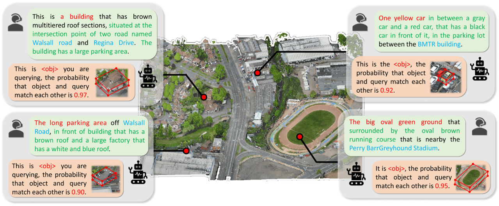
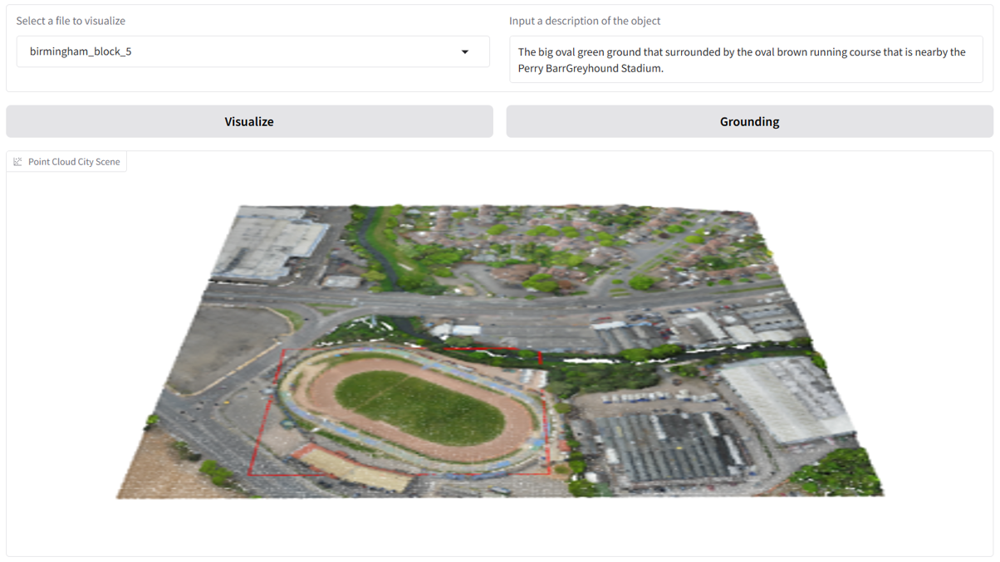

# CityAnchor: City-scale 3D Visual Grounding with Multi-modality LLMs

This is the official PyTorch implementation of CityAnchor. 

## Abstract
 
 
<p align="justify">
3D visual grounding is a critical task in computer vision with transformative applications in robotics, AR/VR, and autonomous driving. Taking this to the next level by scaling 3D visualization to city-scale point clouds opens up thrilling new possibilities. We present a 3D visual grounding method called CityAnchor for localizing an urban object in a city-scale point cloud. Recent developments in multiview reconstruction enable us to reconstruct city-scale point clouds but how to conduct visual grounding on such a large-scale urban point cloud remains an open problem. Previous 3D visual grounding system mainly concentrates on localizing an object in an image or a small-scale point cloud, which is not accurate and efficient enough to scale up to a city-scale point cloud. We address this problem with a multi-modality LLM which consists of two stages, a coarse localization and a fine-grained matching. Given the text descriptions, the coarse localization stage locates possible regions on a projected 2D map of the point cloud while the fine-grained matching stage accurately determines the most matched object in these possible regions. We conduct experiments on the CityRefer dataset and a new synthetic dataset annotated by us, both of which demonstrate our method can produce accurate 3D visual grounding on a city-scale 3D point cloud.
</p>

We have provided a **Colab** template for quick and easy access to CityAnchor! Please click it. [](https://colab.research.google.com/gist/Lijp411/67dce23bb019e57023e415dabcad2926/cityanchor_script_release.ipynb)

## Schedule

To facilitate related research, we plan to make CityAnchor open source, including but not limited to the following:

- [ ] Upload our paper to arXiv and create a project page.
- [x] Create an easy-to-use demo. **Everyone can use CityAnchor!**
- [x] Provide the weights of **pre-trained CityAnchor model (7B)**.
- [ ] Provide the weights of pre-trained CityAnchor model (13B).
- [x] Release the codes inlcuding training and evaluation scripts.
- [x] Release the training data and evaluation data.
- [ ] Create easy-to-follow dataloader script for grounding on your own city-scale dataset (coming soon)
- [ ] Achieve more interesting work.

## 💾 Dataset Download and Processing
### Skip the data preparation
We have provided all the prepared data in [Google Drive](https://drive.google.com/drive/folders/1_cOZFti4FyZtfAyEotXu1PEOFQZEcwBs?usp=drive_link). Please download the files and place them in the ``.\data`` directory, then change the corresponding path in ``.\lib\config.py``. You’ll then be ready to use demo, train and test the model. Training data and evaluation data are available at [meta data](https://drive.google.com/drive/folders/1_cOZFti4FyZtfAyEotXu1PEOFQZEcwBs?usp=drive_link).
### Prepare data
1\) Please download the [CityRefer dataset](https://github.com/ATR-DBI/CityRefer) and organise its data structure as shown below.
```shell
CityAnchor
├── data
│   ├── cityrefer
│   │    ├── meta_data
│   │    │   ├── CityRefer_train.json
│   │    │   └── CityRefer_val.json
│   │    ├── box3d
│   │    │   └── [scene_id]_bbox.json   
```
2\) Please download the [SensatUrban dataset](https://github.com/QingyongHu/SensatUrban) and its [segs data](https://drive.google.com/file/d/13BjNoqKrMJNOlNZiak_oV7b-TSMtst70). Then, you should organize the ``*.ply`` and ``*.segs.json`` in ``scans`` folder as follows:
```
CityAnchor
├── data
│   ├── sensaturban
│   │   ├── scans
│   │   |   |── birmingham_block_1
│   │   |   |   ├── birmingham_block_1.ply
│   │   |   |   ├── birmingham_block_1.segs.json
```

3\) Perform data preprocessing and data augmentation (optional).
```
cd data/sensaturban
sh prepare_data.sh
```

4\) Please use the pre-trained [Uni3D-L](https://github.com/baaivision/Uni3D) model to extract 3D attribute features for each candidate object (In our work, [3D object attribute features](https://drive.google.com/drive/folders/1hKpwoUvqcJ-v2mbw0aws1CAkvBBrg3xd?usp=drive_link) in ``.json`` form are provided for convenience). Please download the [top view map](https://drive.google.com/drive/folders/1oc4MF7qmb2H0jkE35uo9-vD7Dh3bWfde?usp=sharing) rasterized from RGB point cloud in ``.tif`` form. Please download the [landmark features](https://drive.google.com/drive/folders/1_cOZFti4FyZtfAyEotXu1PEOFQZEcwBs?usp=drive_link) in ``.json`` form. Finally, you should organize them in ``pointgroup_data`` folder as follows:
```
CityAnchor
├── data
│   ├── sensaturban
│   │   ├── pointgroup_data
│   │   |   |── balance_split
│   │   |   |   ├── random-50_crop-250
│   │   |   |   |   ├── birmingham_block_1.json
│   │   |   |   |   ├── birmingham_block_1.pth
│   │   |   |   |   ├── birmingham_block_1.tif
│   │   |   |   |   ├── birmingham_block_1_landmark.json
```

## 💻 Requirements
The code has been tested on:
- Ubuntu 20.04
- CUDA 12.2
- Python 3.10
- Pytorch 2.1.0
- NVIDIA A100 GPU (40G).

## 🔧 Installation
  
- Create and activate the conda environment
  ```
  conda create -n CityAnchor python=3.10
  conda activate CityAnchor
  ```

- Install the necessary packages
  ```
  pip install -r requirements.txt
  pip install deepspeed==0.15.1
  pip install --upgrade gradio
  pip install --upgrade "jax[cuda12]" -f https://storage.googleapis.com/jax-releases/jax_cuda_releases.html
  ```

## 🔦 Demo
You can try CityAnchor with the [pre-trained CityAnchor model](https://drive.google.com/drive/folders/1GMSr2d6W9RP3wuesQnMtV-GJnlZeOOyk?usp=drive_link) (and [pre-trained ROI model](https://drive.google.com/drive/folders/1iVHXjOGnf_WhOhg6gKqm93Q8wHbpCqV8?usp=drive_link)) via following commands:

```
python Gradio_Demo_CityAnchor.py --version="PATH_TO_CityAnchor_MODEL" \
--version_stage_1="PATH_TO_ROI_MODEL"
```

After that, please choose the scene and input the object description (For example, **"birmingham_block_5"** and **"The big oval green ground that surrounded by the oval brown running course that is nearby the Perry BarrGreyhound Stadium."**). Then, you should obtain the object given your description.

 

## 🚅 Train
You can train the CityAnchor with pre-trained LLM(VLM) backbone. It takes only about **12 hours** for training to achieve 3D visual grounding in urban scenes of more than **500m*500m** and **400 objects**. Note that RoI segmentation backbone model (SAM) is available at [backbone model](https://drive.google.com/file/d/1shdmFrhzX3QD-8nhF8OV_zkCGWTZU984/view?usp=drive_link).
```
deepspeed --master_port=24999 Train_CityAnchor.py \
  --dataset_dir='./dataset' \
  --vision_pretrained="./sam_vit_h_4b8939.pth" \
  --dataset="cityrefer" \
  --sample_rates="1" \
  --exp_name="CityAnchor_Train_Model_on_CityRefer_Dataset_v1" \
  --epochs=6 \
  --steps_per_epoch=200 \
  --reason_seg_data='SensatUrban-LISA-EX|train'\
  --explanatory=-1 \
  --no_eval
```
When training process is finished, you should get the full model weight:
```
cd ./runs/CityAnchor_Train_Model_on_CityRefer_Dataset_v1/ckpt_model
python zero_to_fp32.py . ../pytorch_model.bin
```
Then, you need to merge the LoRA weights in "pytorch_model.bin", and save the final CityAnchor model into your desired path in the Hugging Face format:
```
CUDA_VISIBLE_DEVICES="" python merge_lora_weights_and_save_hf_model.py \
  --version="PATH_TO_BASED_MODEL" \
  --weight="PATH_TO_pytorch_model.bin" \
  --save_path="PATH_TO_SAVED_MODEL"
```
Friendly reminder that we typically use the final weights `xinlai/LISA-7B-v1`(Recommended) or `LLaVA-Lightning-7B-v1-1` as based model to be merged.

## ✏️ Evaluation
You can evaluate the grounding performance on CityRefer dataset. Please put the pre-trained model in folder `/path/to/checkpoints` and eval CityAnchor using the following commands:
```
CUDA_VISIBLE_DEVICES=0 python Test_CityAnchor_on_cityrefer_dataset.py \
  --version="PATH_TO_CityAnchor_MODEL" \
  --version_stage_1="PATH_TO_ROI_MODEL"
```

## 🤝 Acknowledgement
CityAnchor is built upon the extremely wonderful [LISA](https://github.com/dvlab-research/LISA), [Uni3D](https://github.com/baaivision/Uni3D), [CityRefer](https://github.com/ATR-DBI/CityRefer) and [DeepSpeed](https://github.com/microsoft/DeepSpeed). 

## Contact us
If you find this repo helpful, please give us a star. For any questions, please contact us via lijp57@whu.edu.cn.


